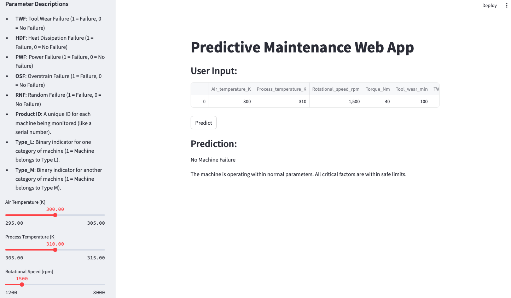

# Predictive Maintenance Web App

This project demonstrates a **Predictive Maintenance Web Application** using **XGBoost** and **Streamlit**. The app predicts whether a machine will fail based on various input parameters such as air temperature, rotational speed, and tool wear. It also provides explanations for machine failures, identifying which specific failure type (e.g., Tool Wear Failure, Heat Dissipation Failure) triggered the prediction.

## Project Overview

- **Purpose**: The goal is to predict machine failure based on historical data of equipment health metrics using a machine learning model and provide an intuitive web interface for users to input machine parameters and view failure predictions.
- **Model**: A **hyperparameter-tuned XGBoost** model is used for predictions, trained on equipment data.
- **App**: Built with **Streamlit** for a clean, interactive user experience, allowing real-time predictions and visualizing input parameters.
  
## Tools and Technologies Used

- **Machine Learning**: 
  - **XGBoost**: Used to train the predictive maintenance model.
  - **SMOTE (Synthetic Minority Over-sampling Technique)**: Applied to handle class imbalance in the dataset.

- **Data Processing**:
  - **Pandas**: Used for data manipulation and analysis.
  - **Scikit-learn**: For model building, hyperparameter tuning, and evaluation.

- **Web Application Framework**: 
  - **Streamlit**: The front-end for the web app that allows user inputs and outputs predictions interactively.

- **Deployment**: 
  - **Streamlit Cloud**: The app is hosted and deployed on Streamlit Cloud to provide a shareable link.
  
## Project Structure

```bash
predictive-maintenance/
│
├── app.py                             # Main Streamlit app script
├── xgb_model.pkl                      # Pickle file for the trained XGBoost model
├── requirements.txt                   # List of dependencies for the project
├── ai4i2020.csv                       # Dataset
├── Predicitive Maintenance Dataset    # Jupyter Notebook
└── README.md                          # Documentation
```
## Usage

### Load the Web Application:
After running the app, open the provided local URL (something like `http://localhost:8501`) in your browser.

### Input Machine Parameters:
Use the sliders in the sidebar to enter machine health data such as:
- **Air Temperature [K]**
- **Process Temperature [K]**
- **Rotational Speed [rpm]**
- **Torque [Nm]**
- **Tool Wear [min]**

Additional inputs like **TWF**, **HDF**, **PWF**, **OSF**, **RNF**, **Product ID**, **Type_L**, and **Type_M** are also provided with detailed explanations.

### View Predictions:
Click the **Predict** button to see whether the machine will fail. If a failure is predicted, the app will also display the specific reason(s) for the failure.


## Example Screenshot

Below is a screenshot of the deployed web app showing how users can input parameters and get predictions about potential machine failures:



## Predictive Model

- **XGBoost Model**: The model is trained on a dataset of machine health parameters using a hyperparameter-tuned XGBoost classifier.
- **SMOTE**: Applied to balance the dataset before training the model.
- **Evaluation**: The model achieves a high accuracy score with strong recall and precision metrics for predicting machine failures.

## Future Work

- **Integrating Real-Time Data**: Connect the app with live machine data feeds to predict failures in real-time.
- **Dashboard Visualization**: Implement a dashboard using **Power BI** or **Tableau** for visualizing equipment health and predictive failure metrics.

## Deployment

The app is deployed on **Streamlit Cloud**, allowing anyone to access it via a shared link.

### Try the App Here: [Streamlit Web App Link](https://share.streamlit.io/yourusername/predictive-maintenance/app.py)

## What I Learned from This Project

Through building this **Predictive Maintenance Web Application**, I gained valuable experience in several areas of data science and web development:

- **End-to-End Machine Learning Pipeline**: I learned how to handle a complete machine learning workflow, including data preprocessing, feature engineering, model training, and hyperparameter tuning using advanced models like **XGBoost**.

- **Class Imbalance Handling**: By using **SMOTE**, I understood how to address class imbalances in datasets, which helped improve the model’s ability to predict rare events such as machine failures.

- **Building a Web App with Streamlit**: I learned how to create interactive web applications using **Streamlit**, which allowed me to easily build a user-friendly interface where users can input machine parameters and receive predictive maintenance insights.

- **Model Deployment**: I got hands-on experience deploying a machine learning model to production using **Streamlit Cloud**, allowing others to interact with the model in real-time through a web interface.

- **Interpretation**: I practiced interpreting model predictions and displaying results in a user-friendly format, 

- **Collaboration & Documentation**: Lastly, I strengthened my skills in documenting projects effectively and preparing code for collaboration, as shown through detailed instructions and explanations provided in the project README.

This project not only enhanced my technical skills but also gave me a better understanding of how predictive maintenance can be applied in real-world scenarios, helping organizations prevent costly equipment failures.
